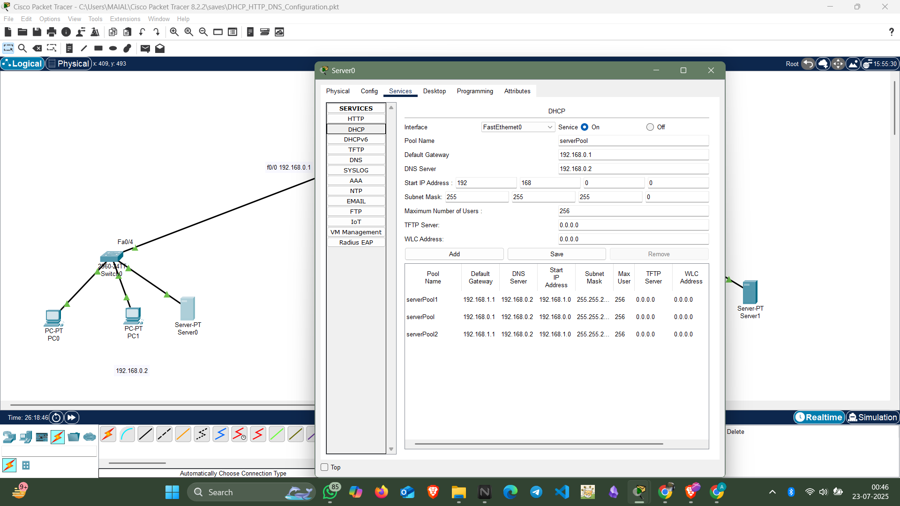
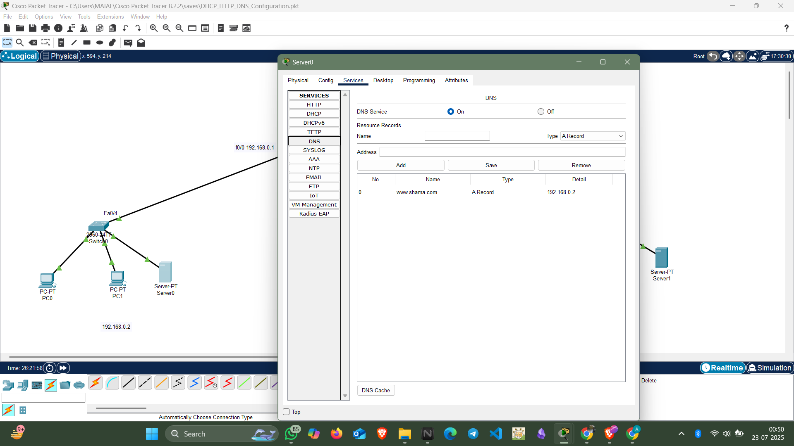

#  DHCP, DNS, and HTTP Simulation in Cisco Packet Tracer

This project demonstrates how to simulate core network services like DHCP, DNS, and HTTP using Cisco Packet Tracer.

##  Features

- ✅ DHCP Configuration with Multiple IP Pools
- 🌐 DNS Server with Custom Domain Resolution (e.g., www.shama.com → 192.168.0.2)
- 🌍 HTTP Web Hosting using Cisco Server
- 🔄 Multi-Network Design with Router Interface Configuration
- 🔌 Static and Dynamic IP Addressing
- 🖥️ Multiple Clients Simulating Different Subnets

## Network Topology

- **3 Subnets:**
  - 192.168.0.x (Switch0, Server0)
  - 192.168.1.x (Switch1, Server2)
  - 192.168.2.x (Switch2, Server1)
- **Router with 3 Interfaces (f0/0, f0/1, f1/0)**
- **DHCP Server on Server0 for 192.168.0.x**
- **DNS Record: www.shama.com → 192.168.0.2**
- **HTTP Web Page Response: "hey!! Shama this side:)"**

## Technologies

- Cisco Packet Tracer 8.2
- DHCP, DNS, HTTP Protocols
- Subnetting and Routing Basics

##  Screenshots

| DHCP Settings | DNS Entry | Web Response |
|---------------|-----------|--------------|
|  |  |  |

##  How to Use

1. Open the `.pkt` file in Cisco Packet Tracer.
2. Click on **Server0 → Services → DHCP/DNS/HTTP** to view configurations.
3. Switch to PCs to verify IP and web page access.
4. Customize your own domain and page!

##  Contact

Shama Parveen 
📧 Email: shama21parveen@gmail.com  
🔗 LinkedIn:https://www.linkedin.com/in/shama-parveen-956258229/  

